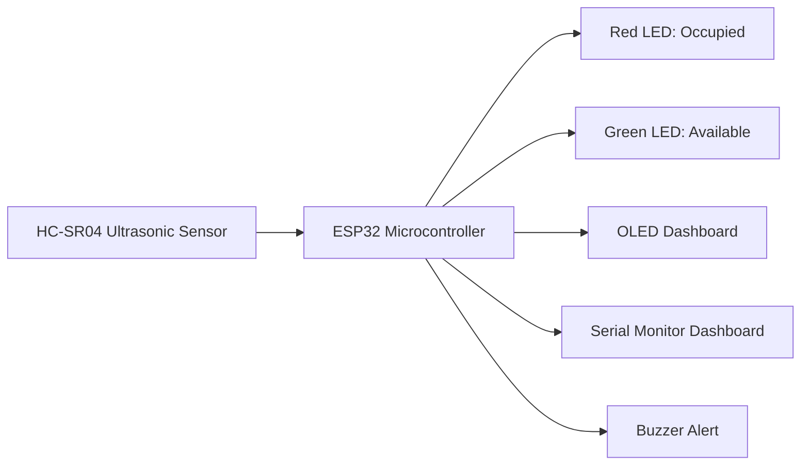

# IoT-Based Smart Parking Space Detector

## Project Overview

**Module:** Internet of Things (IoT) Elective  
**Project Title:** IoT-Based Smart Parking Space Detector  
**Group Name / Number:** `[]`  
**Student Name:** `[Reece Josephs]`  
**Student Number:** `[Student No. 218152701]`  
**Presentation Date:** 20 May 2026

## Project Idea & Problem Statement

### Problem Statement

Finding an available parking bay can waste time, increase congestion, and create confusion in small parking areas. A simple IoT parking bay detector can show whether a bay is free or occupied without requiring a person to inspect it manually.

### Proposed Solution

This project uses an ESP32 and an HC-SR04 ultrasonic distance sensor to detect whether a vehicle or object is inside a model parking bay. When the object is close to the sensor, the bay is marked as occupied and the red LED turns on. When the bay is clear, the green LED turns on. The OLED screen and Serial Monitor act as a simple dashboard showing the measured distance and parking status.

### Objectives

- Detect whether a parking bay is occupied using ultrasonic distance measurement.
- Show the bay status using red and green LED indicators.
- Display the distance and status on an OLED screen and Serial Monitor dashboard.
- Demonstrate a virtual IoT prototype in Wokwi using ESP32 hardware simulation.

## System Architecture & Design

The ESP32 controls the complete system. The HC-SR04 sends distance readings to the ESP32, the firmware decides whether the bay is occupied, and the output devices show the result.

### Design Decisions

- A 50 cm threshold is used for the model bay: below 50 cm means occupied.
- Hysteresis is added so the output does not flicker if the distance is near the threshold.
- The free Wokwi dashboard uses LEDs, OLED, and Serial Monitor because a browser-accessible ESP32 web server requires Wokwi Private IoT Gateway.
- The OLED and buzzer are included as optional enhancement parts to make the virtual demonstration clearer.

## Hardware Components

| Component | Description | Quantity | Purpose |
|---|---:|---:|---|
| ESP32 DevKit C v4 | WiFi-capable microcontroller board | 1 | Main controller |
| HC-SR04 Ultrasonic Sensor | Distance sensor | 1 | Detects object/vehicle distance |
| Red LED | 5 mm LED | 1 | Shows occupied status |
| Green LED | 5 mm LED | 1 | Shows available status |
| 220 ohm Resistor | Current-limiting resistor | 2 | Protects LEDs |
| SSD1306 OLED Display | 0.96 inch I2C display | 1 | Shows distance and status |
| Buzzer | Piezo buzzer | 1 | Alerts when a vehicle/object arrives |
| Breadboard/Jumper Wires | Prototyping hardware | As needed | Physical build equivalent |
| Cardboard/model bay | Demonstration model | 1 | Represents a real parking bay |
| Toy car/object | Demonstration object | 1 | Represents a parked vehicle |

## Software & Technologies

| Tool / Platform | Purpose |
|---|---|
| Wokwi | Virtual ESP32 circuit simulation |
| Arduino C++ | ESP32 firmware development |
| Serial Monitor | Text dashboard for live readings |
| Adafruit SSD1306 Library | OLED display control |
| Adafruit GFX Library | OLED text rendering |
| GitHub/Markdown | Project documentation |

## Circuit Diagram / Wiring

The circuit is defined in `diagram.json` for Wokwi.

| Component Pin | ESP32 Pin | Notes |
|---|---|---|
| HC-SR04 VCC | 5V | Sensor power |
| HC-SR04 GND | GND | Common ground |
| HC-SR04 TRIG | GPIO 5 | Trigger pulse |
| HC-SR04 ECHO | GPIO 18 | Echo pulse input |
| Red LED anode | GPIO 26 | Occupied indicator |
| Red LED cathode | GND via 220 ohm resistor | Current limiting |
| Green LED anode | GPIO 27 | Available indicator |
| Green LED cathode | GND via 220 ohm resistor | Current limiting |
| OLED VCC | 3V3 | Display power |
| OLED GND | GND | Common ground |
| OLED SDA | GPIO 21 | I2C data |
| OLED SCL | GPIO 22 | I2C clock |
| Buzzer positive | GPIO 25 | Arrival alert |
| Buzzer negative | GND | Common ground |

**Physical build note:** On a real ESP32, the HC-SR04 echo pin can output 5V. Use a voltage divider or level shifter to protect the ESP32 input pin. Wokwi allows the direct virtual connection for simulation.

## Code Documentation

### Main Firmware

The main firmware is in `sketch.ino`.

| Function Name | Description |
|---|---|
| `setup()` | Starts Serial Monitor, configures pins, starts I2C, initializes the OLED, and prints dashboard headings |
| `loop()` | Reads distance, decides status, updates LEDs/OLED/Serial Monitor, and checks buzzer alert |
| `readDistanceCm()` | Sends the HC-SR04 trigger pulse and converts echo duration to centimeters |
| `decideParkingStatus()` | Applies the occupied/available threshold with hysteresis |
| `updateIndicators()` | Turns red/green LEDs on or off based on bay status |
| `updateDisplay()` | Writes the bay status and distance to the OLED |
| `printDashboard()` | Prints a readable dashboard line to Serial Monitor |
| `beepOnNewOccupation()` | Sounds the buzzer briefly when the bay changes to occupied |

## Testing & Results

| Test # | Description | Expected Result | Actual Result | Pass/Fail |
|---:|---|---|---|---|
| 1 | Set HC-SR04 distance to 100 cm | Green LED on, red LED off, OLED/Serial show Available | Green LED on, OLED/Serial showed Available at about 101.4 cm | Pass |
| 2 | Set HC-SR04 distance below 50 cm | Red LED on, green LED off, OLED/Serial show Occupied | Red LED on, OLED/Serial showed Occupied at about 42.5 cm | Pass |
| 3 | Move distance around 50 cm | Status remains stable because of hysteresis | Status stayed occupied near 53.7 cm and returned available after moving above 55 cm | Pass |
| 4 | Start simulation | OLED initializes and displays parking dashboard | OLED displayed Smart Parking Bay with status and distance | Pass |
| 5 | Change from available to occupied | Buzzer beeps once | Buzzer output was triggered by the status transition in firmware | Pass |
| 6 | Observe Serial Monitor | Distance and status print every ~500 ms | Serial Monitor printed live distance/status dashboard lines continuously | Pass |

## 🎥 Project Demonstration

[▶️ Watch the Smart Parking System Demo](Smart%20Parking%20System%20Video.mp4)

### Wokwi Screenshots

  
  

## Challenges & Solutions

| Challenge Encountered | Solution Applied |
|---|---|
| Physical project could not be submitted on time | Built a complete virtual prototype using Wokwi |
| Web dashboard from simulated ESP32 requires paid Wokwi Private Gateway | Used free Wokwi OLED, LED indicators, and Serial Monitor dashboard |
| Sensor readings near the threshold may flicker | Added hysteresis: occupied below 50 cm, available above 55 cm |
| Real ESP32 input pins are 3.3V but HC-SR04 echo can be 5V | Documented the need for a resistor divider or level shifter in the physical version |

## Project Demonstration

- **Wokwi Project:** https://wokwi.com/projects/468298076934507521
- **Demo Video:** `[Smart Parking System Video.mp4]`
- **Screenshots:** See `Screenshot 2026-07-04 at 20-45-32 Smart Parking Detector Copy (2) - Wokwi ESP32 STM32 Arduino Simulator.png` and `Screenshot 2026-07-04 at 20-45-47 Smart Parking Detector Copy (2) - Wokwi ESP32 STM32 Arduino Simulator.png`.

## References

1. [Wokwi HC-SR04 Ultrasonic Sensor Documentation](https://docs.wokwi.com/parts/wokwi-hc-sr04)
2. [Wokwi LED Documentation](https://docs.wokwi.com/parts/wokwi-led)
3. [Wokwi diagram.json Documentation](https://docs.wokwi.com/diagram-format)
4. [Wokwi ESP32 WiFi Networking Documentation](https://docs.wokwi.com/guides/esp32-wifi)
5. [Adafruit SSD1306 Library](https://github.com/adafruit/Adafruit_SSD1306)

